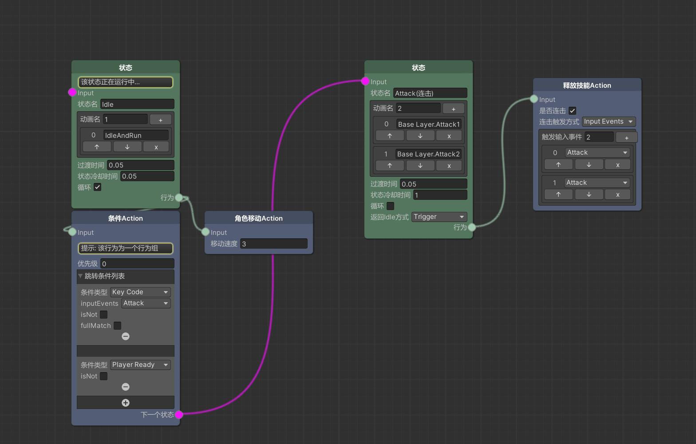
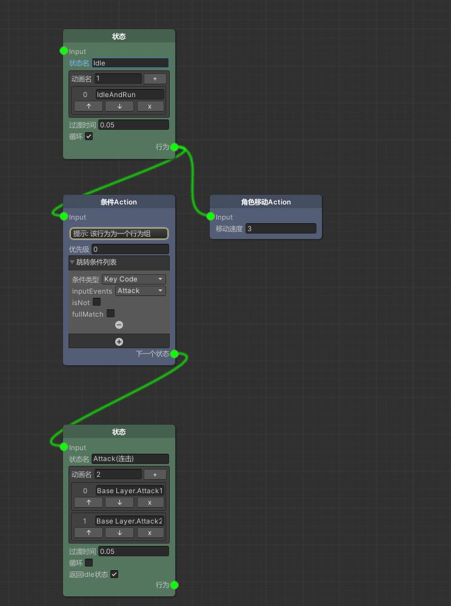
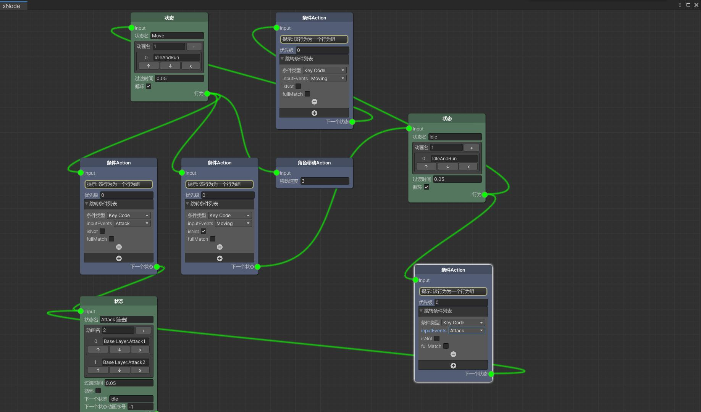
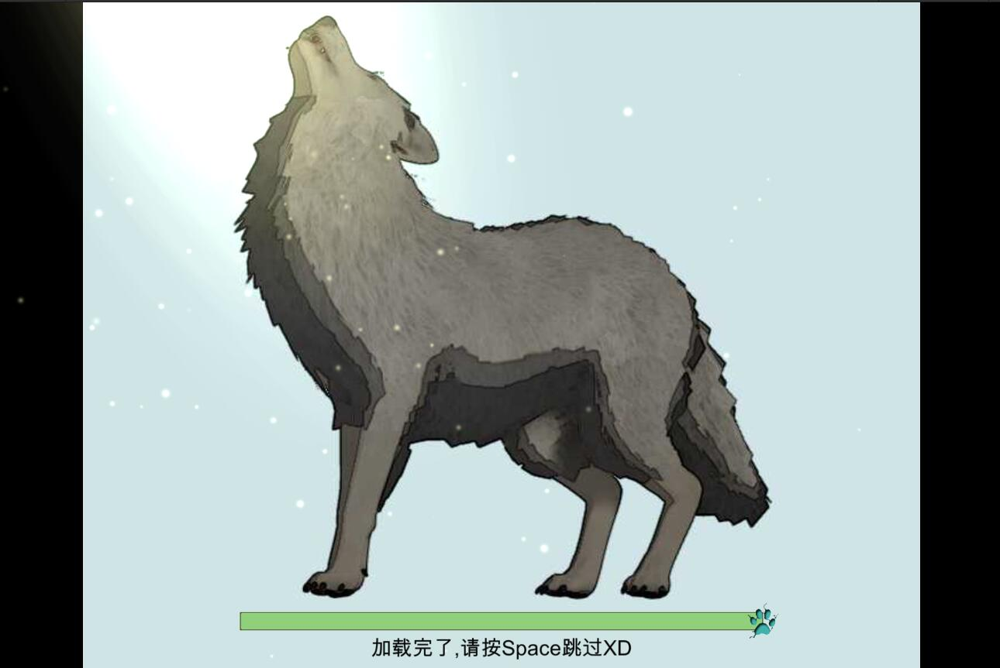
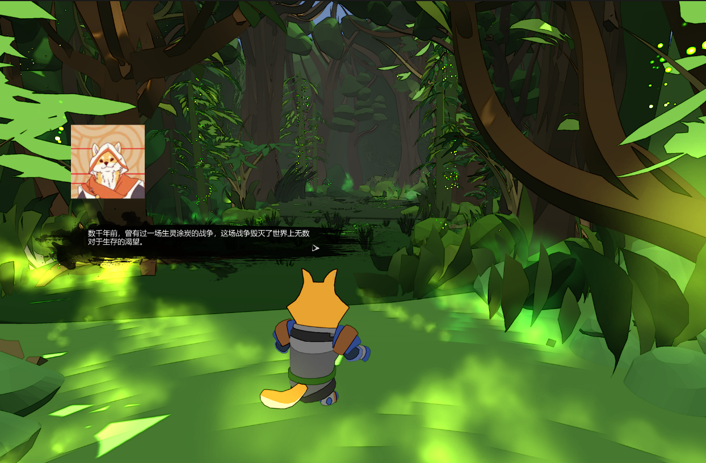
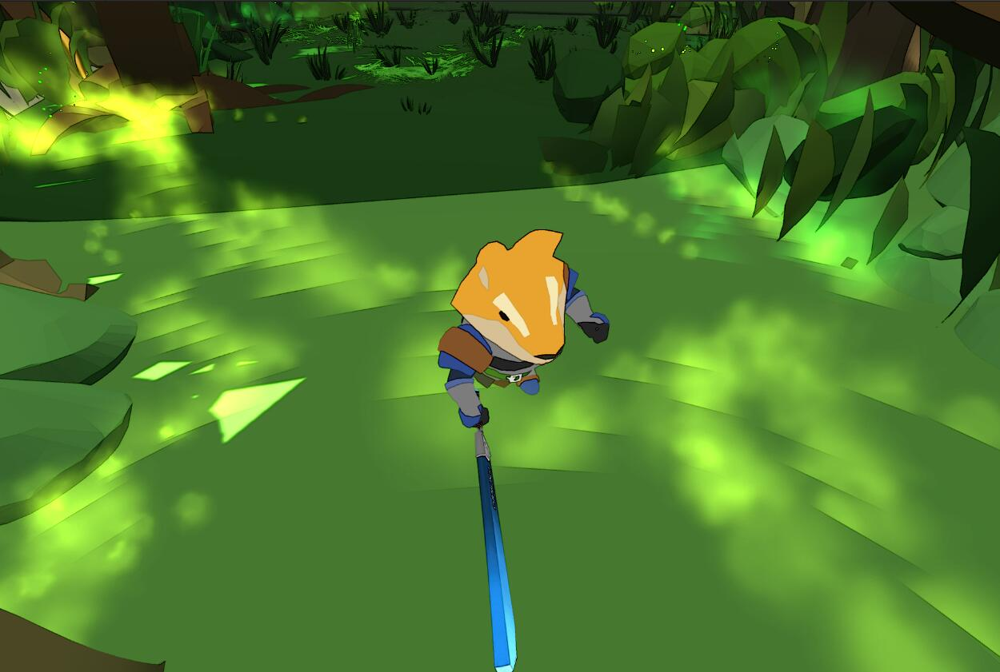
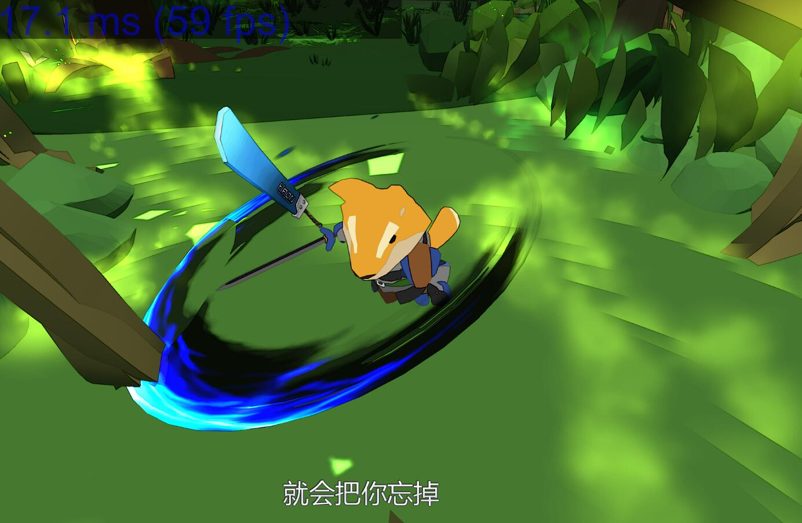
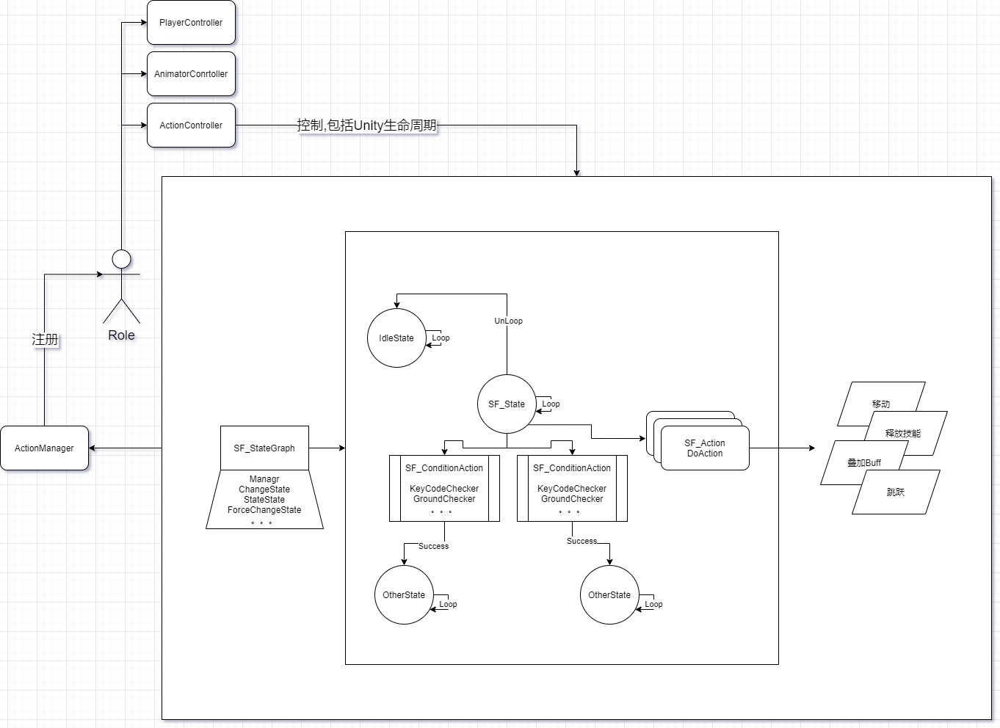

项目文档详见:   [Solvarg](Doc/README.md)  

## 截图
> 基于Action系统的连击(包括技能连击)和技能系统基石搭建完毕

  

> 一个基本的移动和攻击示例

## 设计图

> Action系统设计图

其余系统级简单设计(很久没更新了)
[http://146.56.209.11:90/%e6%b8%b8%e8%ae%be-solvarg/](http://146.56.209.11:90/%e6%b8%b8%e8%ae%be-solvarg/)